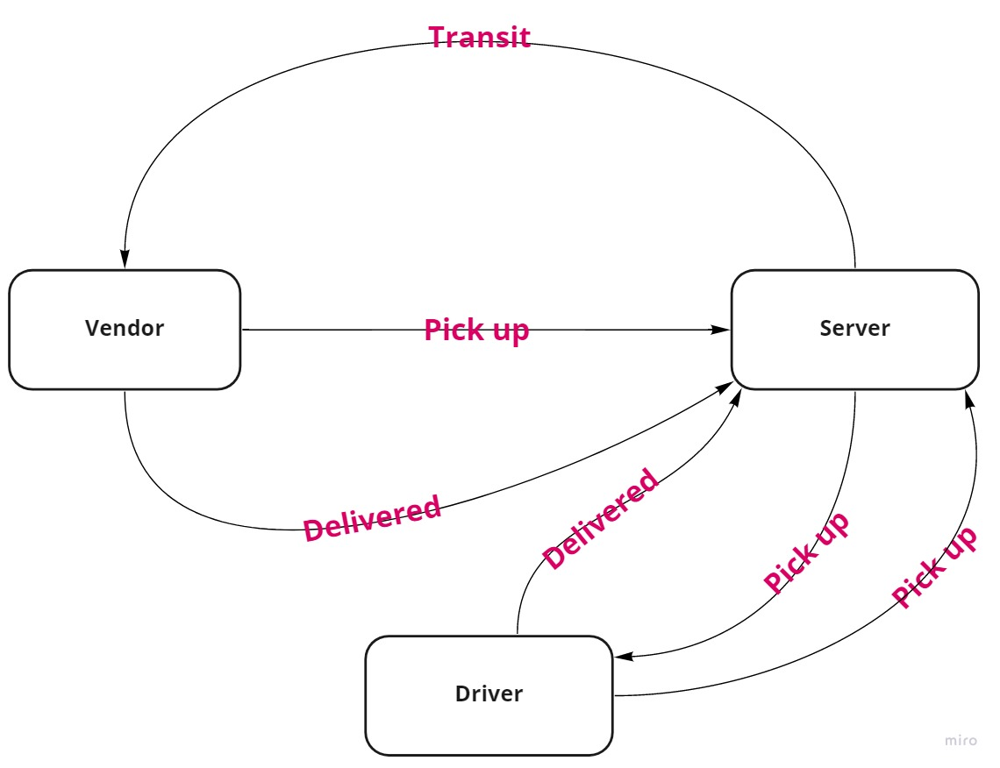

# CAPS

CAPS Phase 1: Begin the build of an application for a company called CAPS - The Code Academy Parcel Service. In this sprint, we’ll build out a system that emulates a real world supply chain. CAPS will simulate a delivery service where vendors (such a flower shops) will ship products using our delivery service and when our drivers deliver them, be notified that their customers received what they purchased.

 #### GitHub repository: https://github.com/Sokiyna/CAPS
 #### PR link : https://github.com/Sokiyna/CAPS/pull/1
 #### GitHub actions: https://github.com/Sokiyna/CAPS/actions

 ## UML

 
